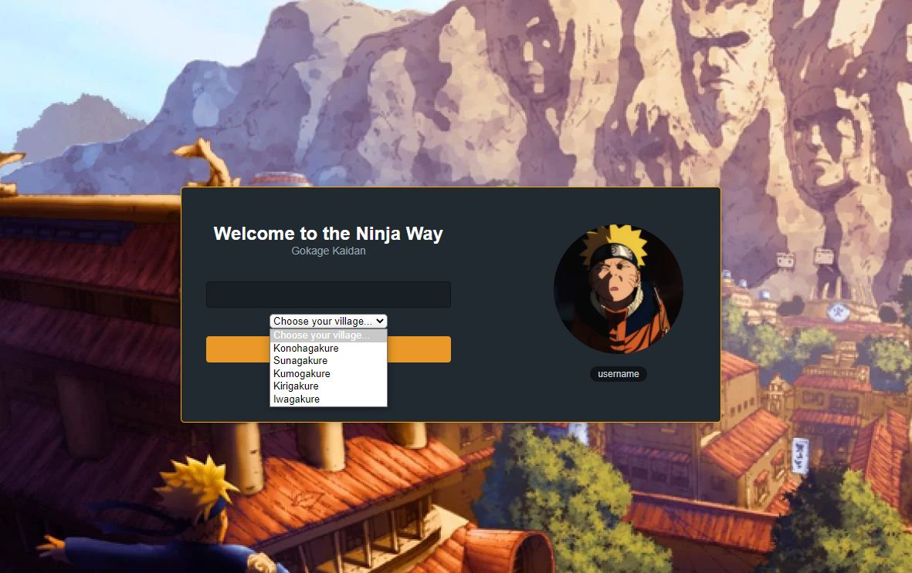

# Chat Naruto

Um simples chat em tempo real, usado Next.js tomando estudos bases pela escola Alura

---

Bibliotecas:

[Nookies](https://github.com/maticzav/nookies)

[Skynexui](https://github.com/skynexui/components)

---

Banco de dados:
[Supabase](https://supabase.com/)
